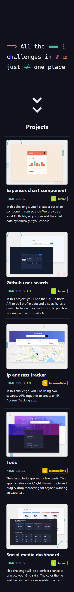
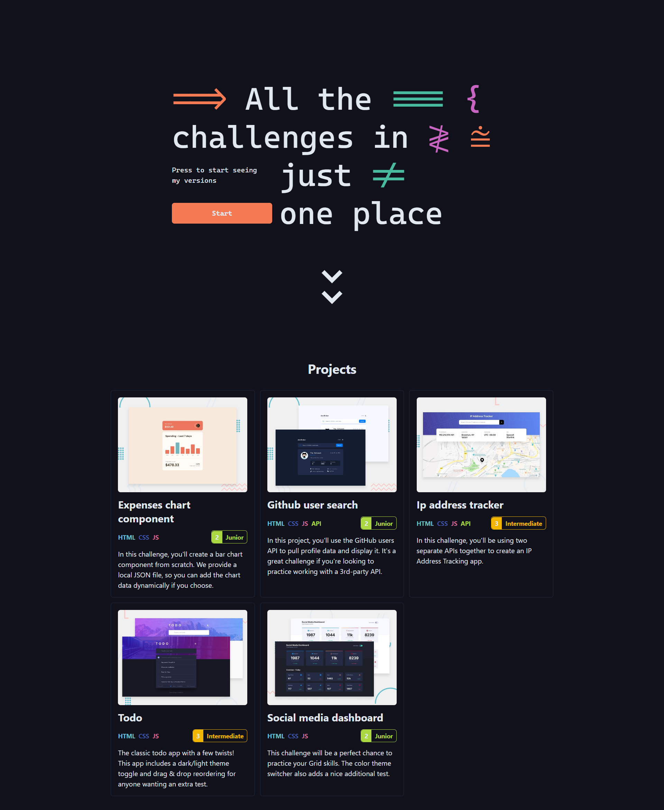

# Frontend Mentor - GitHub User Search

This is a solution to the [GitHub user search on Frontend Mentor](https://www.frontendmentor.io/challenges/github-user-search-app-Q09YOgaH6). Frontend Mentor challenges help you improve your coding skills by building realistic projects.

## Table of contents

- [Frontend Mentor - GitHub User Search](#frontend-mentor---github-user-search)
	- [Table of contents](#table-of-contents)
	- [Overview](#overview)
		- [The challenge](#the-challenge)
		- [Screenshot](#screenshot)
		- [Links](#links)
	- [My process](#my-process)
		- [Built with](#built-with)
	- [Author](#author)

## Overview

### The challenge

Users should be able to:

- View the optimal layout for the app depending on their device's screen size
- See hover states for all interactive elements on the page
- Search for GitHub users by their username
- See relevant user information based on their search
- Switch between light and dark themes
- **Bonus:** Have the correct color scheme chosen for them based on their computer preferences. Hint: Research prefers-color-scheme in CSS.

### Screenshot

### Links

- [Github Repo](https://github.com/s4malve/frontend-mentor-github-user-search)
- [Demo Site](https://62a3d6743eb97f31e84169e4--lustrous-concha-5fab30.netlify.app/)

## My process

### Built with

- Semantic HTML5 markup
- CSS custom properties
- Flexbox
- CSS Grid
- Mobile-first workflow
- [React](https://reactjs.org/) - JS library
- [Tailwindcss](https://tailwindcss.com/) - For styles

## Author

- Frontend Mentor - [@Samalve](https://www.frontendmentor.io/profile/Samalve)
- Twitter - [@s4malve](https://www.twitter.com/s4malve)
