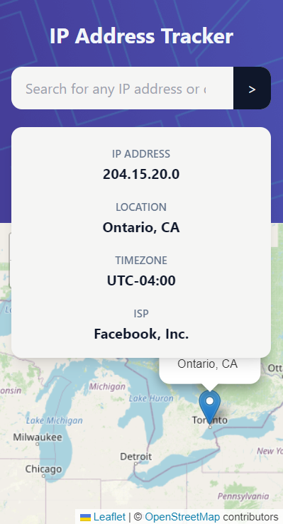
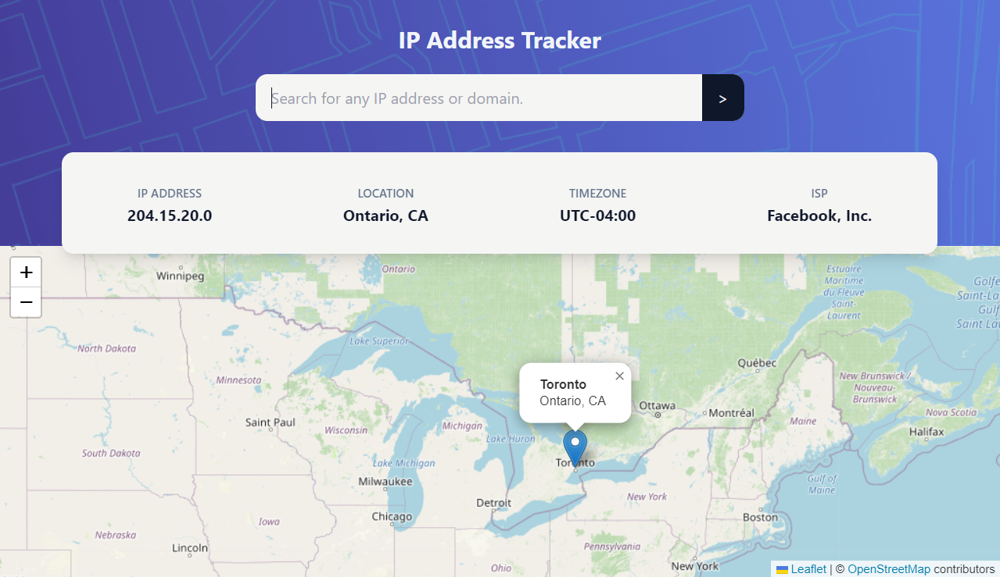

# Frontend Mentor - IP address tracker solution

This is a solution to the [IP address tracker challenge on Frontend Mentor](https://www.frontendmentor.io/challenges/ip-address-tracker-I8-0yYAH0). Frontend Mentor challenges help you improve your coding skills by building realistic projects.

## Table of contents

- [Frontend Mentor - IP address tracker solution](#frontend-mentor---ip-address-tracker-solution)
  - [Table of contents](#table-of-contents)
  - [Overview](#overview)
    - [The challenge](#the-challenge)
    - [Screenshot](#screenshot)
    - [Links](#links)
  - [My process](#my-process)
    - [Built with](#built-with)
  - [Author](#author)

## Overview

### The challenge

Users should be able to:

- View the optimal layout for each page depending on their device's screen size
- See hover states for all interactive elements on the page
- See their own IP address on the map on the initial page load
- Search for any IP addresses or domains and see the key information and location

### Screenshot

### Links

- [Other Solution](https://github.com/s4malve/frontend-mentor/)
- [Demo Site](https://your-live-site-url.com)

## My process

### Built with

- Semantic HTML5 markup
- CSS custom properties
- Flexbox
- CSS Grid
- Mobile-first workflow
- [React](https://reactjs.org/) - JS library
- [React Leaflet](https://react-leaflet.js.org/) - A library its a wrapper around Leaflet.js
- [IP Geolocation API](https://geo.ipify.org/) - API to get the user's IP address
- [Tailwindcss](https://tailwindcss.com/) - For styles

## Author

- Frontend Mentor - [@Samalve](https://www.frontendmentor.io/profile/Samalve)
- Twitter - [@s4malve](https://www.twitter.com/s4malve)
